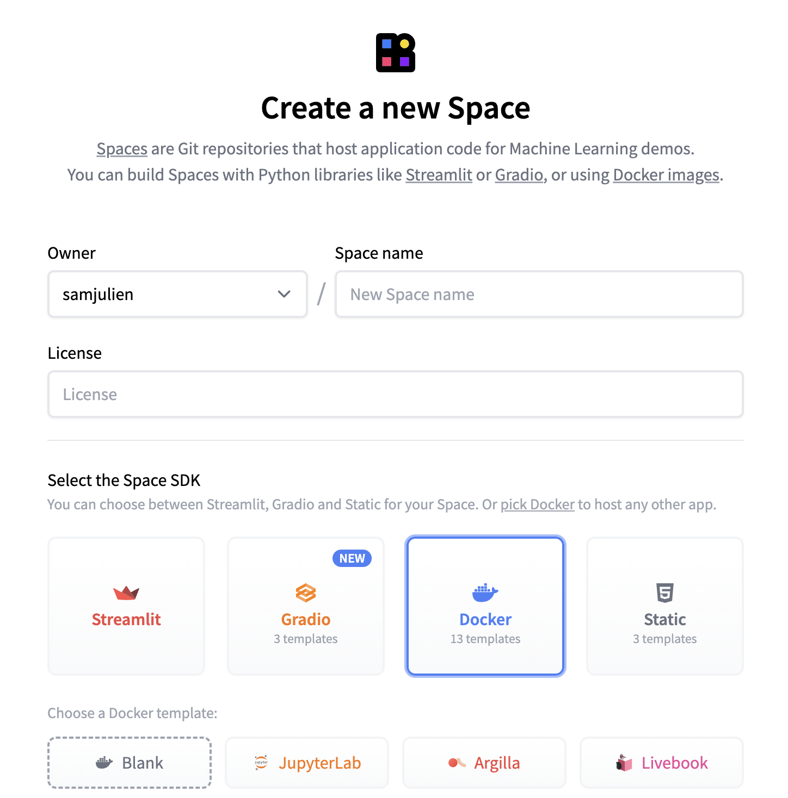

# Deploying a Writer Framework app to a Hugging Face Space
This guide will walk you through the process of setting up a [Writer Framework](https://github.com/writer/writer-framework/) application on [Hugging Face Spaces](https://huggingface.co/spaces). Writer Framework is an open-source framework for creating AI applications. Build user interfaces using a visual editor; write the backend code in Python. It's fast and flexible with a clean, easily-testable syntax. It provides separation of concerns between UI and business logic, enabling more complex applications.


## Prerequisites
- A [Hugging Face](https://huggingface.co/) account
- Git installed on your local machine
- Basic familiarity with command-line operations

## Create a Writer Framework application
If you haven't yet, install the Writer Framework:

```sh
pip install writer
```

We recommend using a virtual environment.

### Create your application
To create a new application, run:

```sh
writer create your-app-name
```

If you'd like to get up and running right away, you can use the demo application:

```sh
writer hello
```

You can check out our [documentation and tutorials](https://dev.writer.com/framework/introduction) to learn more about building with the Writer Framework.

### Optional: Create a Writer Framework API key
You can use the Writer Framework for free. However, if you plan on using the Writer AI module, which uses our API and Palmyra LLMs, you'll need to sign up for [Writer AI Studio](https://app.writer.com/aistudio/signup?utm_campaign=devrel) and create a new Framework application. This will create an API key. You'll set that as a secret in Hugging Face later.

## Create a Hugging Face Space
First, create your Hugging Face Space:

1. Log in to your Hugging Face account.
2. Navigate to the Spaces section.
3. Click on "Create new Space".
4. Choose a name and emoji for your space and select the appropriate settings such as Space hardware and privacy.
5. For the Space SDK, select "Docker" and then "Blank" for the template.



Take note of the git command for cloning your Space to your local machine.

### Optional: Configure environment secret

If you created a Writer Framework API key to use the AI module, you'll need to add it to your Space settings. In the Hugging Face Space settings tab, add a new environment secret:

- Key: WRITER_API_KEY
- Value: Your Writer Framework API key

### Generate a Hugging Face authentication token
To push your code to Hugging Face, you'll need an authentication token. Here's how to create one:

1. Go to your Hugging Face account settings.
2. Navigate to the "Access Tokens" section.
3. Click on "Create new token" and generate a new authentication token.
4. Save this token securely; you'll need it for Git operations and you won't be able to see it again.

### Clone the Hugging Face Space repository
Execute the following command in your terminal:

```sh
git clone https://huggingface.co/spaces/username/space_name
```

Replace `username` with your Hugging Face username and `space_name` with the name you chose for your space.

When prompted:

- Use your Hugging Face username as the username
- Use the generated authentication token as the password

## Prepare your app
You can now prepare your Writer Framework application for deployment.

First, prepare the files:
1. Navigate into the cloned repository directory.
2. Copy your entire Writer Framework application folder into the cloned repository.
3. Move the `pyproject.toml` file from the application folder to the top-level of the cloned repository.

### Create a Dockerfile
Hugging Face Spaces uses Docker to deploy applications. In the root of your application folder, create a file named `Dockerfile`.

Paste the following into the Dockerfile, making sure to change the application directory name towards the end:

```docker
# Build stage
FROM python:3.11-slim-buster AS Build

# Set environment variables for Python and Poetry
ENV PYTHONUNBUFFERED=1 \
    PIP_NO_CACHE_DIR=1 \
    POETRY_NO_INTERACTION=1 \
    POETRY_VIRTUALENVS_CREATE=false \
    POETRY_VERSION=1.7.1

# Set the working directory in the container
WORKDIR /app

# Copy the dependencies file to the working directory
COPY ./pyproject.toml /app/

# Update, install dependencies, and prepare the Python environment
RUN apt-get update && \
    apt-get install -y gcc g++ unixodbc-dev && \
    pip install "poetry==$POETRY_VERSION" && \
    poetry export --without-hashes --format requirements.txt --output requirements.txt && \
    python3 -m pip wheel --no-cache-dir --no-deps -w /app/wheels -r requirements.txt

# Runtime stage
FROM python:3.11-slim-buster AS Run

# Set environment variables for Python and Poetry
ENV HOME=/home/user \
	PATH=/home/user/.local/bin:$PATH

# Create a non-root user
RUN useradd -m -u 1000 user

# Switch to the non-root user
USER user

# Copy wheel files from the build stage
COPY --from=build /app/wheels $HOME/app/wheels

# Set the working directory to where the wheels are
WORKDIR $HOME/app/wheels

# Install the wheel files
RUN pip3 --no-cache-dir install *.whl

# Change app name here to copy the application files to the working directory
COPY --chown=user ./your-app-name $HOME/app

# Set the working directory to the application files
WORKDIR $HOME/app

# Specify the command to run the application
ENTRYPOINT [ "writer", "run" ]

# Expose the port the app runs on
EXPOSE 8080

# Set the default command to run the app
CMD [ ".",  "--port", "8080", "--host", "0.0.0.0" ]
```

Feel free to adjust as needed.

### Expose the necessary port in the README
In the frontmatter your Space's README file, add information about the port your application uses:

```
app_port: 8080
```

## Deploy the application
To deploy the application, you just need to push up your changes to the repo.

In your terminal, execute the following commands:

```sh
git add .
git commit -m "Initial setup of Writer Framework"
git push
```

The Space will automatically build and deploy your application based on the files you've pushed. You can access your deployed application through the Hugging Face Spaces interface. 

### Troubleshooting
If you encounter any issues:

- Double-check your authentication token and ensure it has the necessary permissions.
- Verify that all required files are present in your repository. Particularly check that `pyproject.toml` is at the root of the directory rather than inside your application folder.
- Check that you changed the application directory name in the Dockerfile.
- Check the build logs in your Hugging Face Space for any error messages.

For more information on Hugging Face Spaces, refer to the [official documentation](https://huggingface.co/docs/hub/spaces-overview).

## Conclusion
Your Writer Framework application is now set up as a Hugging Face Space. Congratulations!